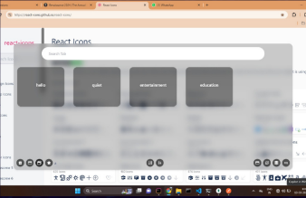
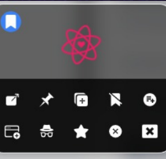

<div align="centre">

  # Tab-task  
</div>

## Table of Contents
<details>
  <summary>Expand</summary>
  <ol>

- [Features](#Features)
- [Images](#Images)
- [TechStack](#TechStack)
- [Installation](#installation)
- [Maintainers](#Maintainers)
- [Technologies](#technologies)
- [License](#license)
- [Contributing](#contributing)

</ol>
</details>

## Images
<div align="centre">
<!--  -->


<!--  -->
<!--  -->
</div>

## Features
- **Search and Filter**: Quickly locate specific tabs using search and filter functionalities.
- **Starring Tabs**: Allows user to starred tabs to work on only limited tabs.
- **Sorting Tabs**: sorting tabs on the basis of alphabetical and last used order to provide convinience for the user.
- **Auto close or hibernate tab**: Tab will automatically close and hibernate as per the users settings after certain time interval decided by the user.
- **Tab Analytics**: Provides analysis for the tab usage for the last week , last day , last 6 hours.


<!-- Badges -->


<!--  -->


#### [Documentation](https://github.com/ShrishRajGupta/Tab-task/blob/main/README.md)
#### [Request Feature](https://github.com/ShrishRajGupta/Tab-task/issues)


##  TechStack 
👾
<details>
  <summary>Client</summary>
  <ul>
    <a href = "https://reactjs.org/">
    React.js </a>
  </ul>
  <ul>
    <a href = "https://tailwindcss.com/">
    Tailwind CSS </a>
  </ul>
  <ul>
    <a href = "https://developer.chrome.com/docs/extensions/reference/api/extension">
    chrome.extension API </a>
  </ul>
</details>

<details>
  <summary>Server</summary>
  <ul>
  <a href = "https://nodejs.org/en/">
    Node.js</a>
  </ul>
</details>

<details>
<summary>Database</summary>
    <ul>
    <a href = "https://www.mongodb.com/" >
    MongoDB</a>
    </ul>
</details>
<br />

## Requirements
[Tab-task](https://github.com/ShrishRajGupta/Tab-task) is a NodeJS application based.

For codebase use the package manager [npm](https://www.npmjs.com/) to install [Tab-task](https://github.com/ShrishRajGupta/Tab-task).

<br>

## Installation
```bash
git clone https://github.com/ShrishRajGupta/Tab-task.git
npm install
cd backend
npm run start
cd ../plugin/contentreact
npm install
npm run start
```

### Chrome Extension
- Go to `chrome://extensions/` in your browser.
- Enable Developer Mode.
- Click on Load Unpacked and select the plugin folder.

Press *ctrl + Q*

### Setup Environment Variables
Create a .env file in the root directory and add the following variables:

```bash
MONGO_URL  # MongoDB URL
ACCESS_TOKEN_SECRET # Random string for JWT
ACCESS_TOKEN_EXPIRY  # Access token expiry time in hours  
REFRESH_TOKEN_SECRET  # Random string for JWT verification
REFRESH_TOKEN_EXPIRY # Refresh token expiry in hours
CORS_ORIGIN # CORS origin
PORT  # Port to run the server on
```

## Maintainers 👨‍💻
  <div>
      <p align="center">
<a href="https://github.com/ShrishRajGupta/Tab-task/graphs/contributors">
  
</a></p>
  </div>

- ### [Shrish Raj Gupta](https://github.com/ShrishRajGupta)   [](https://www.linkedin.com/in/shrishrajgupta/)
- ### [Abhishek Yadav](https://github.com/AbhishekYMNNIT)  [](https://www.linkedin.com/in/abhishekyadav123/)

## Licence 🍁
### [**MIT**](/LICENSE)  &copy; [Shrish Raj Gupta](https://github.com/ShrishRajGupta)

## Contributing 💙

PR's are welcome !Found a Bug ? 

Create an [Issue](https://github.com/ShrishRajGupta/Tab-task/issues).

## 💖 Like this project ?

Leave a ⭐ If you think this project is cool.
 <p align="center"></p>
